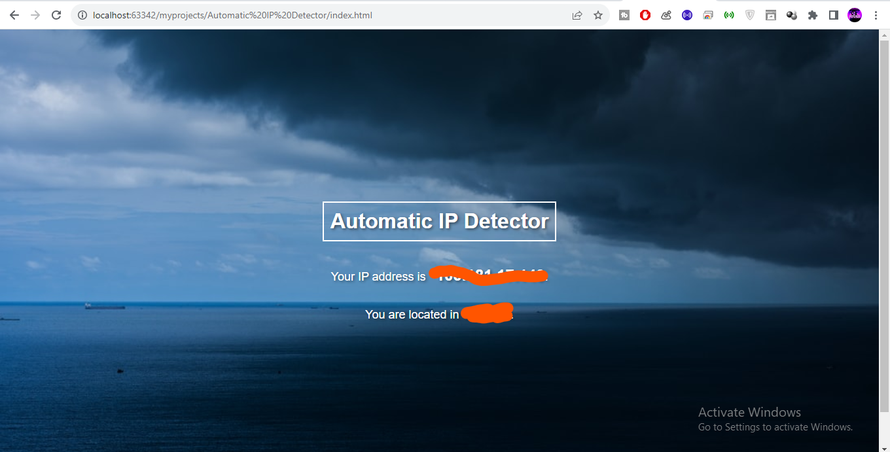

# Automatic IP Detector 
CLICK ON FORK THIS REPO

[](https://github.com/HacktiveMindset/Automatic-IP-Detector/fork)



## Introduction:
Automatic IP Detector is a simple web application that automatically detects the visitor's IP address and provides location-based information, such as the city. This project is built using HTML, CSS, and JavaScript and utilizes external APIs to fetch the user's IP address and location details.

## Getting Started:
To use the Automatic IP Detector application, follow these steps:

1. Clone the repository to your local machine using the following command:
   ```
   git clone https://github.com/HacktiveMindset/Automatic-IP-Detector.git
   ```

2. Navigate to the project directory:
   ```
   cd Automatic-IP-Detector
   ```

3. Open the `index.html` file in your web browser.

## Project Structure:
The project directory structure is as follows:

- `index.html`: The main HTML file that creates the structure of the webpage.
- `styles.css`: The CSS file responsible for styling the layout and elements of the webpage.
- `script.js`: The JavaScript file containing the logic to fetch and display IP and location information.
- `README.md`: This README file providing information about the project.
- `screenshot.png`: A screenshot of the application.

## Dependencies:
The Automatic IP Detector project does not have any external dependencies. It solely relies on HTML, CSS, and JavaScript.

## How it Works:
- The `index.html` file contains the basic structure of the webpage, including the heading and paragraphs to display IP and location information.
- The `styles.css` file defines the visual appearance of the webpage, including font styles, background image, and element alignment.
- The `script.js` file uses JavaScript to interact with external APIs. It fetches the user's IP address from 'https://api.ipify.org' and then retrieves the location details using 'https://ipapi.co/{ip_address}/json/'.
- The fetched data is then dynamically displayed on the webpage.

## Contributing:
Contributions to the Automatic IP Detector project are welcome! If you have any bug fixes, improvements, or new features, feel free to submit a pull request. Please ensure to follow the coding standards and provide a detailed description of your changes.

## License:
The Automatic IP Detector project is licensed under the [MIT License](LICENSE).

You are free to use, modify, and distribute the code as per the terms of the license.

## Acknowledgments:
- The Automatic IP Detector project was created by [HacktiveMindset](https://github.com/HacktiveMindset).
- The project uses the 'https://api.ipify.org' API to fetch the user's IP address.
- Location information is obtained from the 'https://ipapi.co/' API based on the IP address.

## Contact:
If you have any questions or feedback, feel free to contact the project maintainer:
- Name: Piyush Mujmule
- Insta: [PIYUSH MUJMULE](https://www.instagram.com/piyush.mujmule)

Thank you for using Automatic IP Detector! Happy coding!

